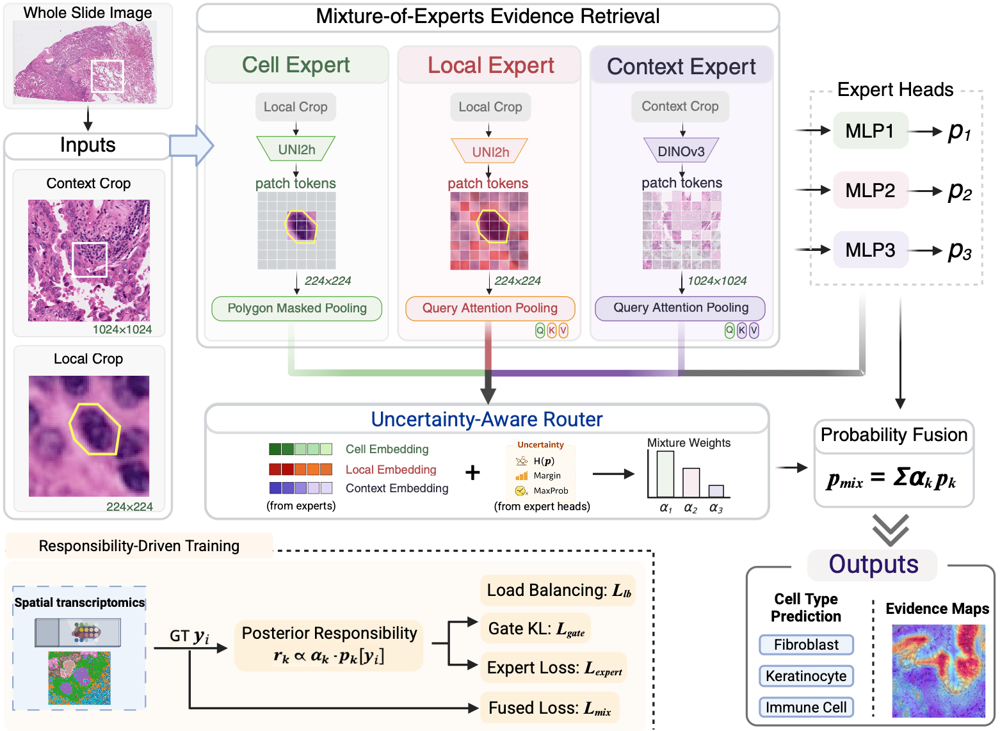
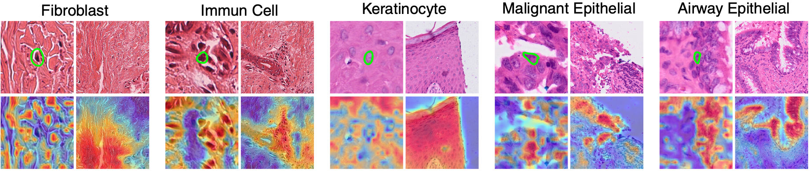

# TRACE

**Token Retrieval And Cooperative Experts** for cell-type classification in H&E.

Code accompanying [*Learning Where to Look: Pathologist-Inspired Multi-Field-of-View
Evidence Retrieval for Cell Type Classification in H&E*](https://papers.miccai.org/miccai-2026/0578-Paper4161.html)
(**MICCAI 2026**), by Ruizhi Yuan, Chongyue Zhao, Tianhao Liu, Qian Wang, Zeqiu Yu,
Lu Tang, Heng Huang, and Wei Chen.

TRACE combines cell morphology, local neighborhoods, and tissue context through
three cooperative experts. Query-guided attention retrieves evidence from each
field of view, and an uncertainty-aware router combines the expert predictions.
This repository provides data preparation, training, evaluation, and evidence-map
visualization for TRACE.


## Model



*Figure 1. Overview of TRACE. Three experts retrieve cell, local, and context
evidence, and an uncertainty-aware router combines their predictions through
probability-space fusion. Training uses posterior responsibilities to coordinate
the experts.*

| Component | Released implementation |
| --- | --- |
| Cell expert E1 | Polygon-masked mean pooling over UNI2-h patch tokens |
| Local expert E2 | E1-query cosine attention over the same UNI tokens |
| Context expert E3 | E1-query cosine attention over DINOv3 context tokens |
| Embeddings | UNI2-h: 1536; DINOv3-base: 768; each projected to 512 |
| Router | Three projected embeddings plus entropy, top-two margin, and maximum probability from each expert |
| Fusion | Softmax router weights times expert **probabilities**, in both training and inference |
| Objective | Weighted, label-smoothed mixture CE; detached-responsibility gate KL and expert CE; load balance; JS conflict weighting |
| Backbones | Frozen UNI2-h and DINOv3-base; trainable attention projections, expert heads, and router |

The local field of view is cropped at 256 x 256 pixels and resized to 224 x 224
for UNI in the provided configurations. The 1024 x 1024 context crop is resized to 256 x 256
for DINO. These are image pixels, not micrometres. Evidence PNGs visualize the
softmax weights used during pooling; the exported `.npy` retains their actual
normalized values.

The loss is implemented in `losses/coop_moe_loss.py`. Label-free fusion is in
`losses/fusion.py`; `model(...)["probs"]` is the prediction distribution, and
`model(...)["logits"]` is its logarithm.

## Evidence maps



*Figure 2. Evidence maps for five cell types. Within each example, the left and
right columns show the local and context views. The top row shows the original
crops, and the bottom row shows the attention overlays. These maps visualize the
pooling weights used to retrieve evidence.*

## Installation

Tested with Python 3.10, PyTorch 2.9.1, torchvision 0.24.1, timm 1.0.22,
and the dependency versions in `requirements.txt`.

```bash
python -m venv .venv
source .venv/bin/activate
python -m pip install --upgrade pip
# Choose the PyTorch wheel appropriate to your system; this is the tested CUDA wheel:
python -m pip install torch==2.9.1 torchvision==0.24.1 --index-url https://download.pytorch.org/whl/cu126
python -m pip install -r requirements.txt
```

Obtain access to [UNI2-h](https://huggingface.co/MahmoodLab/UNI2-h) and authenticate
locally with `hf auth login` if required by your model access. The loader downloads
the pretrained encoders when training/evaluation starts. Model weights and access
tokens are not distributed here. DINO is loaded using the timm model identifier
`vit_base_patch16_dinov3.lvd1689m`. Respect the upstream model terms.

Run commands from this repository root. Config paths are resolved relative to the
working directory. A CUDA device is the default; `--device cpu` is supported but
full backbone execution on CPU is expensive. Adjust batch size to GPU memory.

## Data included and excluded

Only these compressed cell-ID/cell-type tables are provided:

| File | Compressed size | Intended label level |
| --- | --- | --- |
| `annotations/lung_cancer_annotation.csv.gz` | About 1.45 MB | `level_2` |
| `annotations/skin_cancer_annotation_no_unknown.csv.gz` | About 0.55 MB | `level_3` |

The tables contain cell IDs and hierarchical cell-type annotations. The skin
table excludes unknown cells. Checksums are in `docs/source_manifest.json`;
see [annotation details](annotations/README.md) for their format and data sources.

**No raw H&E datasets, Visium HD labels, polygons, expression matrices, embedding caches,
training outputs, or pretrained/trained weights are included.** The manuscript PDF
is also not part of this repository. The two manuscript figures above are included
as documentation assets.

## Xenium data format and preparation

Obtain the H&E image and matching Xenium coordinates/boundaries from the same
specimen. Public data sources cited by the manuscript are:

- [Xenium Prime human skin](https://www.10xgenomics.com/datasets/xenium-prime-ffpe-human-skin)
- [Human lung cancer post-Xenium technical-note datasets](https://www.10xgenomics.com/datasets/xenium-human-lung-cancer-post-xenium-technote)

The lung source includes different assay versions. Match cell barcodes to the
annotation table before preparing data; changing a filename does not convert
Xenium V1 and Prime barcodes into each other.

Example local layout (all contents under `data/` stay local):

```text
data/
  lung/
    Xenium_Prime_Human_Lung_Cancer_FFPE_he_image.ome.tif
    Xenium_Prime_Human_Lung_Cancer_FFPE_he_imagealignment.csv
    cells.csv.gz
    nucleus_boundaries.csv.gz
  skin/
    Xenium_Prime_Human_Skin_FFPE_he_image.ome.tif
    Xenium_Prime_Human_Skin_FFPE_he_imagealignment.csv
    cells.csv.gz
    nucleus_boundaries.csv.gz
```

Change the paths in `configs/xenium_lung.json` or `configs/xenium_skin.json` if your
download filenames differ. The selected annotations, image, alignment matrix, and
cell coordinates must refer to the same sample.

Required raw formats:

| Input | Format |
| --- | --- |
| H&E | RGB TIFF/OME-TIFF, highest-resolution series used for cropping |
| Alignment | Headerless 3 x 3 CSV numeric matrix; this loader applies its inverse to Xenium pixel coordinates |
| Cells | CSV or CSV.gz with `cell_id` (or `barcode`) and `x_centroid`,`y_centroid`; `x`,`y` and `centroid_x`,`centroid_y` aliases are supported |
| Boundaries | CSV or CSV.gz with `cell_id` (or `barcode`) and `vertex_x`,`vertex_y`, one row per vertex |
| Annotations | CSV or CSV.gz with the cell ID in `cell_id`, `barcode`, an index column such as `Unnamed: 0`, or the first column; cell types in `level_1`,`level_2`,`level_3` or `level1`,`level2`,`level3` |

For example, an annotation CSV may contain:

```csv
cell_id,level_1,level_2,level_3
example-cell-1,Stromal,Fibroblast,Fibroblast
example-cell-2,Immune,Immune_cell,T_cell
```

These rows are illustrative, not additional released cell annotations.
When `input_is_micron` is true, the loader divides coordinates by `xenium_mpp`
(default 0.2125) before applying the inverse alignment. Verify that convention
against your supplied registration matrix. Polygon arrays use **[y, x]** order.

```bash
python scripts/prepare_xenium.py --config configs/xenium_lung.json
python scripts/prepare_xenium.py --config configs/xenium_skin.json
```

Preparation produces `cells_prepared.csv`, `polygons.npy`, and `meta.json` in the
configured `prepared_dir`. It joins annotations by cell ID, keeps cells with a
non-missing selected label and a valid polygon, and reports retained counts.
No expression matrix or `analysis.tar.gz` is required for annotation-based labels.
The command requires an empty output directory so that an existing prepared
dataset is not silently overwritten.

Prepared data schema:

```text
cells_prepared.csv: cell_id, centroid_u, centroid_v, level_1, level_2, level_3, poly_idx
polygons.npy:      one-dimensional object array; polygons[poly_idx] has shape (2, P)
meta.json:         image path, alignment/source paths, coordinate units, retained counts
```

`centroid_u` is H&E x, `centroid_v` is H&E y. Only levels present in the source
annotation are required. The literal string `unknown` is a class unless excluded
upstream. The supplied skin annotation already excludes unknown cells; start with
a new prepared directory when changing annotation files to avoid stale labels.

## Visium HD / polygon-indexed skin data

The `skin` dataset adapter reads pre-existing image/label/polygon triples. It does
not derive labels from gene expression or perform segmentation. Supply your own
private inputs; no Visium HD labels are released.

```text
data/visium_hd/
  images/slide_A.tif
  labels/slide_A.csv
  polygons/slide_A_polygons_expanded_array.npy
```

Pair files by the same slide stem. The label CSV requires a configured label column
(e.g. `cell_type`) plus `poly_idx`, a zero-based index into the polygon array.
Alternatively, `index` can end with the polygon number. `cell_id` is recommended;
without it the CSV row index is used. Polygons are an object array of `(2, P)`
arrays containing `[y, x]` coordinates in the corresponding H&E image.

```csv
cell_id,poly_idx,cell_type
example-cell-1,0,Fibroblasts
example-cell-2,1,T_cell
```

`configs/visium_hd.json` is a data-interface template with slide-group validation,
not the manuscript's unavailable in-house split. Set `label_col` to an existing
CSV column for multiclass training. The dataset adapter also accepts selected
cell-type names for target-versus-others tasks. Whole-slide images in this adapter
are loaded into memory; worker count affects RAM use.

## Training

```bash
CUDA_VISIBLE_DEVICES=0 python train.py --config configs/xenium_lung.json
CUDA_VISIBLE_DEVICES=0 python train.py --config configs/xenium_skin.json
CUDA_VISIBLE_DEVICES=0 python train.py --config configs/visium_hd.json
```

Optional operational overrides:

```bash
python train.py --config configs/xenium_lung.json \
  --out_dir runs/lung_small_batch --batch_size 64 --num_workers 4 --save_attention
```

E1 queries both attention pools using cosine attention without Gaussian bias.
Expert probabilities use unit temperatures; training includes load balancing and
JS conflict weighting. Dataset paths and numerical training parameters are
specified in JSON. Training uses one device per process.

The frozen encoders generate patch tokens during the forward pass; no separate
feature-extraction step is needed. Training requires spatial patch tokens, which
cannot be recovered from pre-pooled feature vectors.

The Xenium configurations default to a stratified random-cell split. This is not the manuscript's contiguous spatial-region split. For an
explicit split, set `split_csv` in the config to a CSV with
`sample,cell_id,poly_idx,split` and exactly one `train` or `val` assignment for
every cell. Xenium's sample key is `xenium`; skin sample keys are slide stems.
The runner writes its resolved split manifest for every new run.

Outputs:

```text
runs/<experiment>/
  config.json
  split_manifest.csv
  history.json
  ckpt_best.pt
  diagnostics/
    metrics.json
    coop_moe_stats.json
    predictions.csv
    local_attn_maps/<true_class>/<sample_key>/...
    ctx_attn_maps/<true_class>/<sample_key>/...
```

Attention outputs are optional. The same selected cell IDs occur in both map
directories, covering up to `attn_maps_per_class` correct and incorrect cases per
true class. Each includes the input crop, heatmap, overlay, raw attention weights,
and `meta.json`; the local view also includes the mask and polygon overlay.

Checkpoint selection uses validation macro OVR ROC-AUC for multiclass runs, or
PR-AUC when configured for binary runs. A non-finite objective aborts training
before an optimizer update. Output directories must be new/empty.

## Evaluation

```bash
python evaluate.py \
  --checkpoint runs/xenium_lung/ckpt_best.pt \
  --out_dir runs/xenium_lung_eval --device cuda --save_attention
```

The checkpoint stores class ordering, training class weights, validation indices,
and a hash of the ordered sample IDs/labels. Evaluation checks the hash and uses
the saved validation membership. `--config` can relocate dataset paths on a
different machine without overriding model/training settings. Use the same
prepared tables and pretrained backbone versions.

Checkpoints contain trainable heads/pooling/router parameters, not frozen
pretrained encoder weights. The encoders are reloaded from their saved identifiers.
Trained checkpoints are not bundled. Metrics are reported for each expert and the
fused probability distribution. The classification report's `macro avg` contains
separate precision, recall, and F1 fields; macro F1 is its `f1-score` entry.

## Tests and citation

```bash
python -m unittest discover -s tests -v
```

Tests use synthetic data and tiny token encoders. They cover probability fusion,
detached responsibilities and KL direction, gradient flow, annotation formats,
split integrity, a complete training/reload/evaluation step, and paired attention
exports. See [validation checks](docs/validation.md) for the tested behavior and
its scope.

Please cite the accompanying manuscript when using TRACE. Author and repository
information is provided in `CITATION.cff`.
